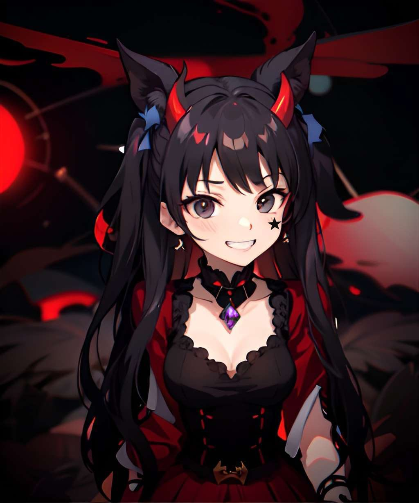

<video  autoplay src="anime-animated-fog-shmah.mp4" controls title="Title"></video>

Subscriberss

Followers

## Documentation

Here are some useful documentation links:
- Getting started guide:  https://alelievr.github.io/Mixture/manual/GettingStarted.html
- Node library: https://alelievr.github.io/Mixture/manual/nodes/NodeLibraryIndex.html
- Mixture graph examples: https://alelievr.github.io/Mixture/manual/Examples.html
- Known issues: https://alelievr.github.io/Mixture/manual/KnownIssues.html

## Roadmap

The roadmap is available on Trello: https://trello.com/b/2JiH2Vsp/mixture. If you have a Trello account, you can vote on cards to prioritize a feature.

# Community 

## Discord

Join the [Mixture Discord](https://discord.gg/DGxZRP3qeg)! 

## Feedback

To give feedback, ask a question or make a feature request, you can either use the [Github Discussions](https://github.com/alelievr/Mixture/discussions) or the [Discord server](https://discord.gg/DGxZRP3qeg).

Bugs are logged using the github issue system. To report a bug, simply [open a new issue](https://github.com/alelievr/Mixture/issues/new/choose).

## Contributions 

All contributions are welcomed.

For new nodes, check out [this documentation page on how to create a new shader-based node](https://alelievr.github.io/Mixture/manual/ShaderNodes.html). Once you have it working, prepare a pull request against this repository.  
In case you have any questions about a feature you want to develop of something you're not sure how to do, you can still create a draft pull request to discuss the implementation details.

# Gallery / Cool things

You can open a Mixture graph just by double clicking any texture field in the inspector with a Mixture assigned to it.

[Surface Gradient](https://blogs.unity3d.com/2019/11/20/normal-map-compositing-using-the-surface-gradient-framework-in-shader-graph/) powered normal map operations.

Extract buffers (depth, normal, color or position) from the rendering of a prefab and use it directly in the graph (HDRP Only).

Fractal nodes in Mixture:

Mixture Variants:

https://user-images.githubusercontent.com/6877923/115474571-03c75800-a23e-11eb-8096-8973aad5fa9f.mp4

Earth Heightmap node:

https://user-images.githubusercontent.com/6877923/123006036-64e2e780-d3b7-11eb-922e-018994b32da5.mov